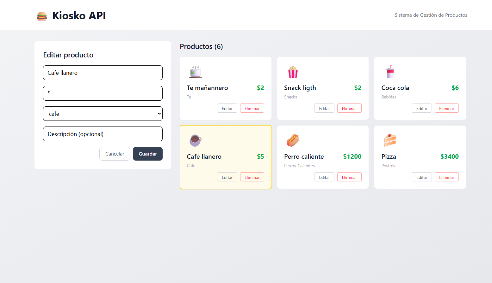

# Kiosko API — CRUD MERN Stack

Sistema de gestión de productos para un kiosko de comidas. Permite crear, editar y eliminar productos organizados por categorías (hamburguesas, bebidas, café, etc.).
El backend expone una REST API con Express y MongoDB Atlas. El frontend consume esa API con React y muestra los productos en tiempo real con un formulario lateral.
La conexión a MongoDB usa el driver nativo de Mongoose con soporte para DNS personalizado para evitar problemas de resolución SRV en Windows.



---

## Correr el proyecto

**Backend**
```bash
cd back-end
npm install
npm start
# Corre en http://localhost:8000
```

**Frontend**
```bash
cd front-end
npm install
npm run dev
# Corre en http://localhost:5173
```

> Asegurate de tener configurado el archivo `back-end/.env` con `PORT` y `MONGO_URL` antes de iniciar.
